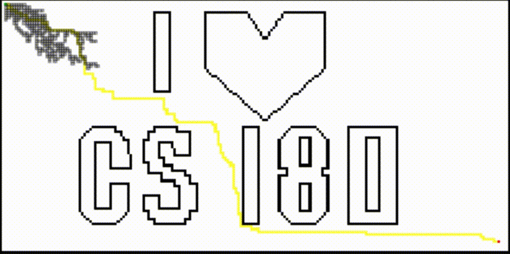

# CS 180 Artificial Intelligence

# Machine Problem 1: Path Planning



In this machine problem, we are tasked with implementing search algorithms (BFS, DFS, A*) to find the shortest path (any path in the case of DFS) between two points on a plane that has polygonal obstacles.

Start with [Index](Index.ipynb)

## Dependencies

Most packages needed by this project is installed by the Anaconda distribution. Some of the main dependencies (apart from Jupyter) with versions listed here:

```
JSAnimation==0.1
matplotlib==3.0.3
numpy==1.16.2
Pillow==5.4.1
```

Note that we're using [JSAnimation](https://github.com/jakevdp/JSAnimation) due to a [bug](https://github.com/JuliaLang/IJulia.jl/issues/414) with `IJulia` and matplotlib's `to_jshtml()`

## Credits

**Group I <3 CS 180**

Member/s:
* Arian Allenson M. Valdez
